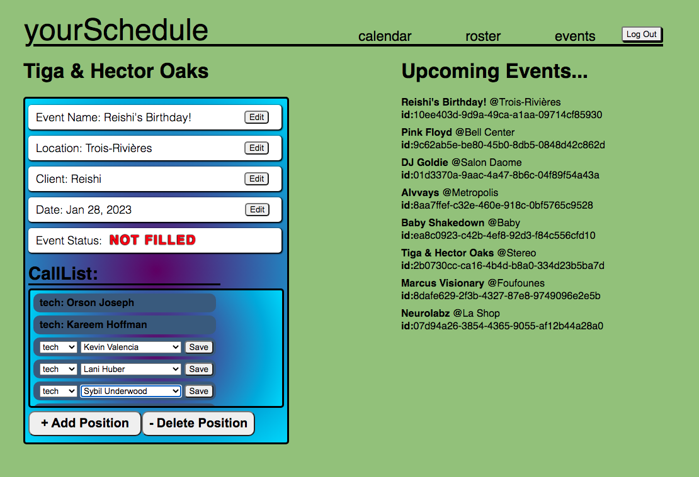

# yourSchedule
A simple and intuitive scheduling app

After logging in, users are met with the Calendar...

Easily discovering the ability to add events, a user can then navigate to the
events page either by clicking on a newly generated event, or using the navbar.

From the events page, details can be updated and modified, with clear visual
indicators showing a user what they are changing, in real time.  

Interacting with this page gives a clear indication as well that these events 
we are creating are intended to be populated with attendees - this leads the 
user through to the Roster page where member details can be viewed.

One of the principles for the interface design of this app is the concept of 
interface redundancy. 

https://www.sciencedirect.com/science/article/abs/pii/S1071581918306190#:~:text=Redundancy%20in%20interface%20design,et%20al.%2C%202004).

There are many state values within the app which can be modified/set from 
multiple different places within the application. This is by design, allowing 
the user to manipulate the state of the app without conscious decision-making, 
instead relying upon their intuition and a general "feel" which is provided by 
the app's visual layout and design.  I believe that a well made app's interface
can often be discovered through non-focused play with the app.  

Here are a few examples to illustrate this concept:

  1. The AddEventModal makes use of a setModalVisibility useState hook.  Rather
  than having this hook located directly within the CalendarPage component from
  which AddEventModal is rendered, the hook is stored instead insde the Calendar
  Context.  This allows the AddEventModal to be displayed or hidden via a button
  located on the main CalendarPage component, as well as with a "x" close modal
  button located in the AddEventModal component itself.  

  2. A feature I have tried/am trying to implement is a Global Edit mode for the
  individual CallListPositions which are displayed on the EventPage.  This would
  be another example of building redundancy into the UI, where a user can easily
  modify the CallList data structure using either individual components by click
  on each individual component, or toggle the same functionality in a global way.
  This allows the user to quickly navigate around the interface without thinking
  about which "mode" they are in.  I also went to great lengths in order to have
  it be possible to open and modify multiple individual "CallListPosition" cells
  at a given time - and modify/save changes without the displayed state of unique
  cells changing.  This was tricky as a junior dev!

  3. The Calendar itself is another example of redunancy - users can cycle through
  different Calendar dates by using the nav tools in the Calendar header section,
  and this date is always reflected in the AddEventModal.  Similarly, making date
  changes in the AddEventModal will reflect in real time in the Calendar display,
  making the Calendar a kind of visual interface for what dates you are selecting.

  4. Lastly, the AddEventModal can be easily loaded up by simply clicking on any
  square in the Calendar.  While there is a large, easy to see button displayed on
  the bottom of the screen for users, they do not even need to notice this! Instead
  they can 'play' with the interface and start clicking around without any danger
  of modifying or destroying data, and the intended use of the application reveals
  itself through interaction.
